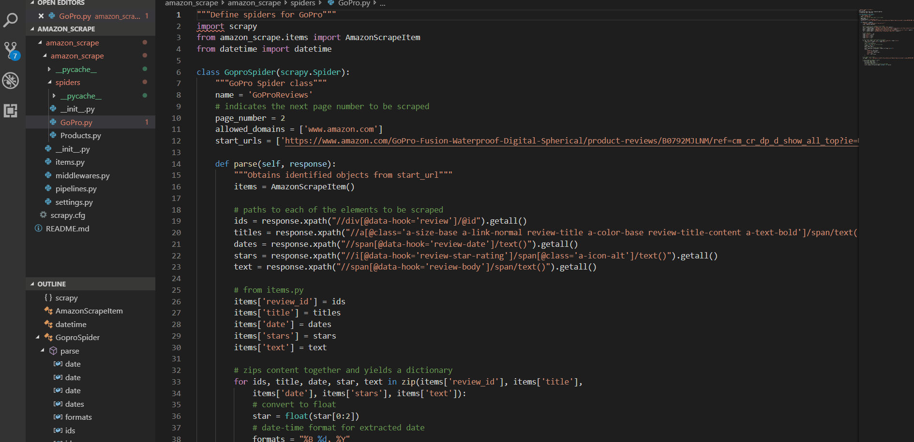

# Amazon Scraping Project

## How to Run

Make sure that your MongoDB is running

Navigate in the terminal to the folder head of this project and run the first spider by typing 'scrapy crawl GoProReviews'.
This spider will store scraped information in a collection called 'GoProReviews' with each review as a separate item.

After that spider runs check to make sure there is a new DB titled 'Amazon' with the collection 'GoProReviews' in your local MongoDB.

In the terminal, run the second spider by typing 'scrapy crawl Products'.
This spider will scrape key product information and store it in the 'Amazon' DB in a new collection titled 'Products'.
It will also use the product_id and add this to every review from the 'GoProReviews' collection.

See a demo of how to run below:

